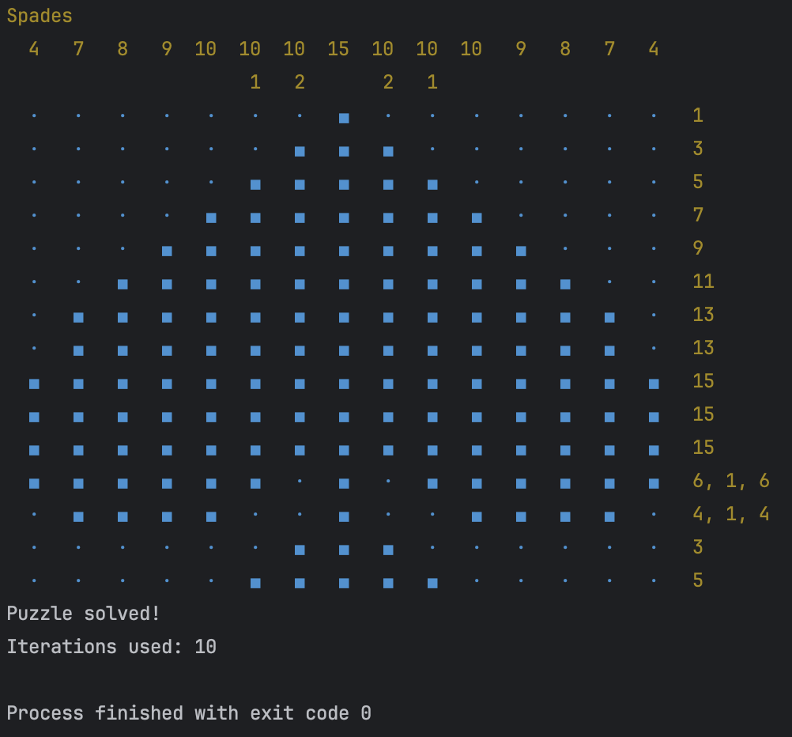

# NonoRust
This is a fun project which I have used to teach myself Rust programming.

(The Rust code here is probably sub-optimal and may not be idiomatic, but this was a learning project 😊)

## Puzzle Files
The puzzle files in the `data` folder are from: [https://github.com/mikix/nonogram-db](https://github.com/mikix/nonogram-db)
Each puzzle file is a YAML file which contains the puzzle definition. The required format should be clear from an examination of any one of the puzzle files in the `data` directory.

## Example Usage
Compile the code, and then run the executable, pointing it to a puzzle file.  See the `data` directory for examples.

```bash
nonorust --path=./data/spades.nonogram.yaml --max-iterations=100
```


## Example Screenshot

